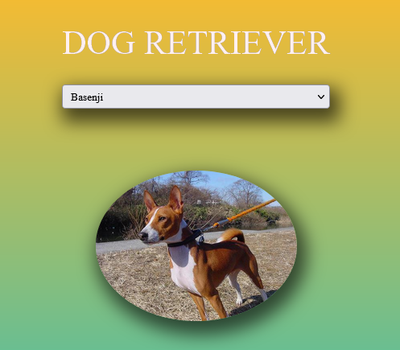

# ma-Doggo

Project connecting to an API to fetch data from a JSON resource. It's a simple web app with plain javascript that will retrieve information from an API and display it on the page, client-side.

## API:
This project consumes the Dog API : [Api here!](https://dog.ceo/dog-api/documentation/#google_vignette)

## interface:

